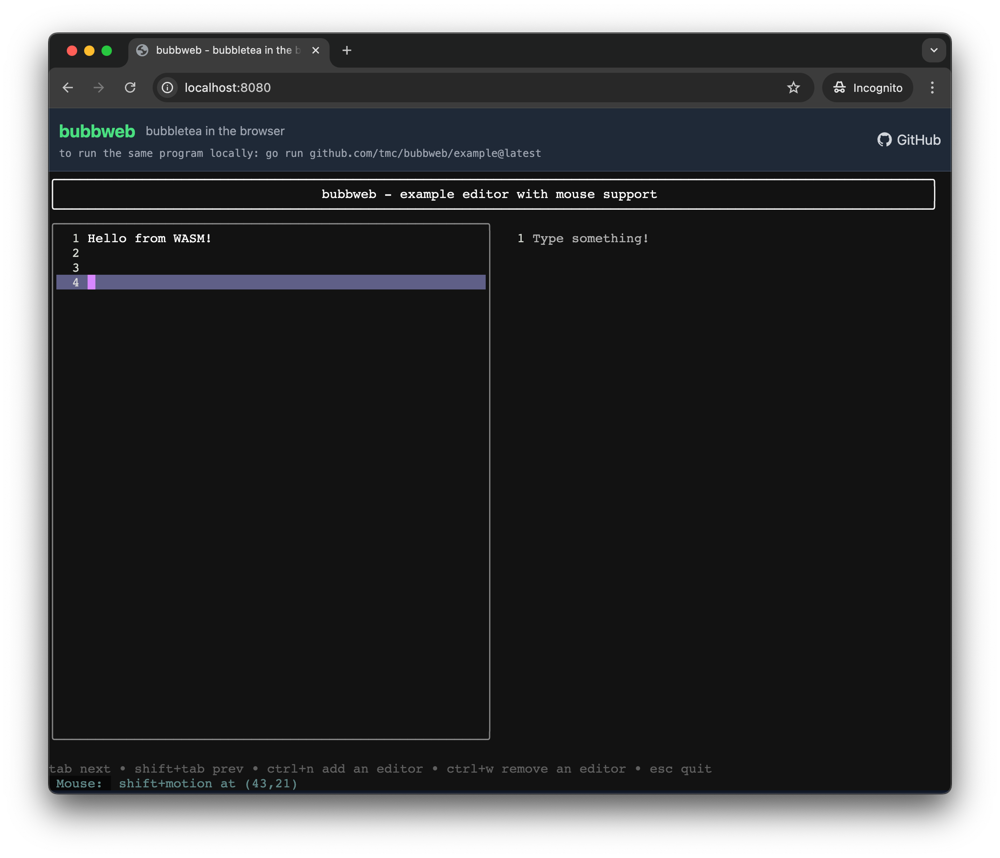

# Bubbletea in WASM

<p align="center">
  
</p>

Run [Bubbletea](https://github.com/charmbracelet/bubbletea) TUI applications in WebAssembly. `main.go` contains a working example with the bubbletea split-editor example.

## Compilation Issues

### 1. `github.com/atotto/clipboard`

Clipboard doesn't have function stubs for JavaScript. Add a file `clipboard_js.go`:

```go
//go:build js
// +build js

package clipboard

import (
	"errors"
)

func readAll() (string, error) {
	return "", errors.New("not implemented")
}

func writeAll(text string) error {
	return errors.New("not implemented")
}
```

Solution:
<details>
<summary>Add a replace directive in <code>go.mod</code> to use a version with JavaScript support</summary>

```go
// Use a forked version of clipboard with JavaScript support
replace github.com/atotto/clipboard => github.com/your-username/clipboard v0.0.0-fork
```
</details>

> 💡 Alternative: Use PR from https://github.com/atotto/clipboard/pull/48

### 2. `github.com/containerd/console`

The version bubbletea uses lacks JavaScript stubs. Use a newer version:

<details>
<summary>Add a replace directive in <code>go.mod</code> to use a newer version</summary>

```go
// Use a newer version of console with JavaScript support
replace github.com/containerd/console => github.com/containerd/console v1.0.4-0.20230706203907-8f6c4e4faef5
```
</details>

### 3. Bubbletea JavaScript implementations

Add JavaScript implementations for TTY and signals:

**tty_js.go**
```go
//go:build js
// +build js

package tea

import (
	"errors"
	"os"
)

func (p *Program) initInput() error {
	return nil
}

func (p *Program) restoreInput() error {
	return nil
}

func openInputTTY() (*os.File, error) {
	return nil, errors.New("unavailable in js")
}
```

**signals_js.go**
```go
//go:build js
// +build js

package tea

// listenForResize is a no-op on the web.
func (p *Program) listenForResize(done chan struct{}) {
	close(done)
}
```

Solution:
<details>
<summary>Add a replace directive in <code>go.mod</code> to use a version with JavaScript support</summary>

```go
// Use a forked version of bubbletea with JavaScript support
replace github.com/charmbracelet/bubbletea => github.com/your-username/bubbletea v0.0.0-fork
```
</details>

## Integration with Browser

Use [xterm.js](https://xtermjs.org/) as terminal in the browser. The implementation redirects input/output and provides JavaScript functions for communication.

See `main.go` for details on:
- Setting up buffers for I/O
- Exposing JavaScript functions for input/output/resize
- Creating a Bubbletea program with custom I/O

See `example/index.html` for details on:
- Setting up xterm.js
- Communicating with the WASM module
- Handling resize events

## Building

```shell
# Build everything with go generate
go generate

# For local testing with auto-reload
cd example
go run github.com/cosmtrek/air@latest -c ../.air.toml # or any live reload server that supports SSE
```

Then open http://localhost:8000 in your browser.

## Deployment

This project can be easily deployed on GitHub Pages:

1. Push the `example` directory to your GitHub repository
2. Go to repository Settings → Pages
3. Set the source to the branch containing your `example` directory
4. Configure the root directory to `/` or `/example` depending on your repository structure
5. Save the settings and GitHub Pages will deploy your application

Your Bubbletea WASM application will be available at `https://[username].github.io/[repository]` or `https://[username].github.io/[repository]/example`.